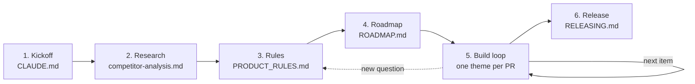

# Playbook

How an app goes from an idea to the stores. Every stage leaves a file behind, so a fresh Claude session, or you months later, can pick up from the files alone. The chat is disposable; the repo is the memory.

## 1. Kickoff: `CLAUDE.md`

- Name, one-line pitch, platforms, stack.
- **Product principles:** three to five promises every feature must keep, such as "ads never interrupt a task, no account, data leaves only by user export". They live in `CLAUDE.md`, so every session sees them, and every rule cites them.
- **Store IDs now:** they're permanent after the first upload. Derive them from the product (`com.<product>.app`), never from your personal name.
- **Tooling on day one (Phase 0):** CI, the format hook, `/verify`, `/release`, the version check, and branch protection. It's cheap on an empty repo and painful to retrofit.
- **Store accounts on day one too.** Everything else in the roadmap is measured in days; account verification and Play's 14-day closed test are measured in weeks, and the ads-and-purchase item at the end cannot be tested without them. Start the paperwork while writing the first line of code, and write down the date the closed test has to begin.

`new-app.ps1` + `/kickoff` do all of this.

## 2. Research: `docs/research/competitor-analysis.md`

- Use the leading app hands-on with made-up data (install it on an emulator), and read its store listing and data-safety page. Describe it in your own words; copy nothing from it.
- Record what you didn't explore, so the gaps are explicit.
- Output: an at-a-glance table (them / us today / our plan), what they do well, their weak spots (your opening), a one-line positioning, and the roadmap impact.
- **Learn, don't copy.** The competitor shows what users expect. Our rule has to be better, not the same.
- **There may not be one, and that is a stage outcome too.** Record it in the file, dated, with why — nothing close enough, deliberate, or not yet. Then `/spec` opens each section with **Learn** instead of **They do**, and writes the rules from the user need. What it must never do is invent a competitor to fill the shape: every rule underneath would then cite a guess as observed behaviour, and the guess is what gets defended later. The starter rules this kit ships are written that way already — **Learn** and no **They do** — so the shape has a worked example.
- If an agent drives the emulator, give it a hard cap (about 45 tool calls), a checklist of at most eight questions, and UI text dumps instead of screenshots. An uncapped run took 143 calls; the capped one took 33.

## 3. Rules: `docs/PRODUCT_RULES.md`

- One section per area: **They do** → **Learn** → **our rules**. `/spec <area>` writes one.
- A rule is testable: a number, a default, an order, an edge case. Rule IDs (`BUD-3`) are stable. Code comments, tests, PRs, roadmap items, and changelog entries cite them.
- "Not verified" marks competitor behavior you only partly saw.
- Open questions go to the user; the answers become a numbered, dated **Decisions** list.
- Rules that shape stored data (integer money, stable UUIDs, soft delete, timestamps) land in Phase 1, **before any user data exists**. Later they mean migrating real data.
- New questions come up during the build. Answer them in the rules file first, then in code.

## 4. Roadmap: `docs/ROADMAP.md`

| Phase | What | Why it's in this order |
|---|---|---|
| 0 Tooling | CI, hooks, skills, release pipeline, branch protection — **and the developer accounts** | Every later PR runs through it. The accounts are here because they are the only item measured in weeks: verification, then 14 continuous days of closed testing before Play will even take a production application |
| 1 Foundations | Data model rules, migrations, dependency injection for tests, reliable writes, localization scaffolding | Features build on it, and it can't change cheaply once users have data |
| 2 Features | In dependency order; backup/export after the last schema step | Each item's data exists before anything reads it |
| 3 Store readiness | Names, icons, IDs, privacy policy, licence, permission checks, packaging | The app has to look like a product before a reviewer sees it |
| 4 Before release | Late scope, dated. Languages first, first-run walkthrough last | Later PRs translate as they go; the walkthrough shows finished features |
| 5–7 Release | One phase per store, in the order they ship: Google Play, then the desktop stores, then Apple | One store's paperwork and review never hold up another |
| 8 After launch | Vitals and reviews each release; the annual target-API bump; declarations that expire | Shipping starts a clock the roadmap has to hold, or the app quietly stops being listed |

- Items cite rule IDs and get ticked in the PR that completes them.
- Every decision that adds, moves, or drops an item gets its date inline.
- Known bugs that aren't fixed yet are listed at the end of the file.

## 5. Build loop

One theme per PR. Bundle related items: one-checkbox PRs cost more review time than they save.

1. `git switch main`, `git pull --ff-only`, then branch `feat/<theme>`. Never stack on an unmerged branch.
2. `/spec <area>` if the rules aren't written yet.
3. Front-load what only a device or CI can prove, such as native glue, permissions, and platform builds (`gh workflow run ci.yml --ref <branch>`), before writing the feature on top of it.
4. Model → migration → state → screen → test → analyze. Translations go in the same change.
5. `/verify`.
6. `/ship`: coverage of the changed files, missing tests, docs, `/release`, driving the built app by hand, then the PR (`--body-file`).
7. **Stop.** You test and merge. The merge builds as a check and leaves nothing behind: the store artifact is built locally and uploaded by hand.
8. `/handoff` before clearing the chat. On "resume", Claude reads it, checks `gh pr list`, and takes the next item.

## 6. Release: `docs/RELEASING.md`, `CHANGELOG.md`

- SemVer `x.y.z+N`. CI refuses a PR whose version isn't above the one on `main`, or that has no changelog entry.
- **Nothing is published from CI and nothing is tagged** — no GitHub Release, no artifact, no store upload, no `vX.Y.Z`. `release.yml` builds and runs its gates as a *check*, and that is all it leaves behind. The artifact a store receives is built on one machine, signed from a gitignored local keystore, and uploaded by a person. A CI build is unsigned or debug-signed unless the signing secrets are set, so anything downloadable from a workflow is a build nobody can install over an existing copy and nobody can upload — while looking exactly like the one that shipped. The record of a version is its `CHANGELOG.md` entry and the commit that raised it.
- **With no tags, the version gate compares against the trunk.** `scripts/version.sh check` reads the version on `origin/main` and refuses a PR that doesn't rise above it. On main itself — the merge build — it compares against the commit *before* the merge instead, which is what keeps the old tag-era safeguard: two PRs opened together both pass against the same trunk, and without that second look the one merged last would ship as part of no release. It needs `fetch-depth: 2`.
- **Check the signer before every upload.** Falling back to a debug key is silent, and the store just rejects the upload without saying why. `keytool -printcert -jarfile <artifact>`; on Windows call it as `"$JAVA_HOME/bin/keytool.exe"`, since a bare `keytool` may not be on PATH and then prints nothing, which reads as a pass.
- Changelog entries are written for users: what they can now do, not class names.
- `/release` also writes the store's release notes in every listing language, into `store/` (gitignored), where the listing text, graphics and data-safety files live too.
- One-time store setup takes weeks, which is why the accounts are a Phase 0 item and not a Phase 5 one. Confirm the current production-access rule in the console: it is an application asking what the testers did, not a counter.
- The privacy policy lives in `docs/` on GitHub Pages. Update it in every PR that touches user data. Pages publishes everything in `docs/`, so `docs/_config.yml` decides what is public and CI fails when a new doc is neither excluded nor declared.
- **A bad release is fixed forward, never backward.** A published version code can't be reused, and reverting the merge produces a PR whose version is at or below main's — which the version check refuses, wedging the pipeline in the one hour it matters. Halt the rollout, then ship a patch (`docs/RELEASING.md` → When a release is bad).

## The session is the unit of cost

Every turn re-sends the whole conversation, so what you pay for is the *length of the session*, not the size of the question. A one-line question late in a long session costs about what any question costs by then.

- **Images are the worst offender and they never leave.** One screenshot per thing that has to be judged by eye — right-to-left layout, a chart, a theme — and text dumps of the UI for everything else.
- **Keep tool output small.** Grep with a path and read line ranges; run tests with a failures-only reporter; never print a whole file or a lockfile to look at three lines.
- **Hand bulky mechanical work to a subagent.** Its context never comes back — only its result. Translations, doc and changelog edits, release chores, and long build logs all belong there.
- **Compact or clear between roadmap items.** This is the whole win, and it is free. `/handoff` is what makes it safe: the state is in the repo and in memory, so the chat is disposable.
- **Tokens are turn count; minutes are the tool.** A subagent with thirteen calls pays its `CLAUDE.md` baseline thirteen times, and that is fixable by handing it the answer instead of the search. A build that takes twelve minutes is Gradle, Xcode or CI, and no prompt shortens it — the only fix is not running it. Question any step still going after about five minutes: say what it is doing, and whether anything depends on the result.

A memory plugin does not fix this. It helps you *start fresh cheaply*, which is valuable, but it cannot shrink a session that is already long.

## Adding a tool: skills and plugins

A **skill** is instructions on disk, loaded only when invoked. The skills in this kit cost nothing when idle and are reviewable in a diff, so adding more is close to free.

A **plugin with lifecycle hooks** is a different thing. Before installing one, answer:

1. **Does it run on every session, or only when called?** On-demand is free when idle; a hook is a standing cost.
2. **Does it ingest tool output and replay it later?** That is a prompt-injection surface: something hostile in a file, a web page, a CI log, or an imported file can persist and resurface in a later session, summarised into something that reads like fact. Without it, a bad tool result dies with the session.
3. **Does it spend tokens in the background?** Some index or compress with their own model calls, billed to you.
4. **Is its state reviewable in a diff, or opaque?** A text file you can read and correct beats a database you cannot.
5. **Does it duplicate what `CLAUDE.md` and the docs already say?** Two sources of truth that can disagree are worse than one.

**Stale memory is worse than none**: whatever a tool stored is later asserted with the confidence of fact. Prefer curated files you can fix in one edit.

A dependency deserves the same suspicion — see the permissions row below.

## Lessons that earned a rule

Each of these cost real time once. The fix is already in the template.

| What happened | Rule now |
|---|---|
| Four one-item PRs in a row cost more review time than the work | Bundle by theme (`CLAUDE.md` Workflow) |
| A branch built on an unmerged branch drifted | Always branch from a freshly pulled `main` |
| PowerShell 5.1 split double quotes in a here-string: `gh pr create` failed after the push, and a failed commit left an empty branch pushed | Bodies and messages go through files: `--body-file`, `git commit -F` |
| `gh workflow run --ref` straight after a push built the previous commit | Check `git ls-remote` matches `HEAD` first, then the run's `headSha` |
| An Arabic PDF shipped with every Latin word reversed; its test only checked for `%PDF-` and a byte count | Tests assert what the user sees, e.g. read the text back out (`/ship`) |
| Hand-driving found a plural message repeated on every row and minus signs trailing in right-to-left layouts; unit tests passed | Drive every screen feature in one RTL language and one theme before the PR |
| A real device service as a constructor default hung the test suite for 10 minutes | Default to no-op fakes; build real services only in the entry point |
| A plugin would have added boot, wake-lock, and foreground-service permissions to a "collects nothing" app | CI checks the release manifest's permissions; prefer ~100 lines of glue to a heavy package |
| `dist/` still held 1.0.0 after the branch moved to 1.0.1 | `/release --build` rebuilds the local artifact after every app change on the branch |
| Store IDs almost carried a personal name | IDs and publisher metadata use the product name only |
| Test data on the emulator belonged to the user | Put back anything changed while testing |
| The chat gets cleared to save tokens, and context went with it | `/handoff` writes the state to memory; "resume" reads it |
| A format check passed early in the session, a file was edited afterwards, and CI's format gate failed — twice in one day | The format check is the last thing before `git commit`, not a mid-session step. A hook that formats on edit is not a substitute: files written by shell redirection skip it |
| A second push landed on a branch whose PR had already been merged, so the commit missed its release and had to be cherry-picked onto `main` | Before pushing to a branch that has been open a while, check `gh pr view <n> --json state` |
| An asset's size was estimated rather than measured; the real figure was twice the guess and would have changed the decision | Measure, then put the trade-off to the user with the numbers in it. Never decide scope on a remembered file size |
| A development build serving live ads can get the ad-network account suspended for self-clicks | Real ad unit IDs only in release builds; every other build uses the network's own test units, chosen by build mode in one config file |
| An SDK read its account ID from the platform manifests before any app code ran, so the same ID lived in three files | When a value must exist in more than one place, add a test that fails when they drift apart |
| One long session carrying a few screenshots burned a double-digit share of a usage window | Compact between items; one screenshot per thing to judge (see "The session is the unit of cost") |
| Listing text, store graphics and data-safety files lived in Downloads, outside any repo | Everything store-facing goes in the repo's gitignored `store/` |
| Play's release notes were written by hand, in one language, after the upload | `/release` writes them in every listing language with the version |
| Closing the purchase sheet without buying left "Waiting for the store" spinning; the tests only covered buying and declining | Test every way an external flow can end, including the user just closing it |
| The classic branch-protection API said 404 for a `main` a ruleset already protected, and a duplicate ruleset nearly followed | Check with `gh api repos/<owner>/<repo>/rulesets` |
| Restoring an emulator snapshot brought back app versions the user had removed on purpose | Put back only what the session changed; ask before loading anything older |
| A release spent twelve of its fourteen minutes rebuilding the artifacts CI builds again on merge | Local artifacts are built when they will be used (`/release --build`) |
| Writing three release-note bullets opened translation files of 25–40 KB per language | Notes come from the changelog entry alone, in one write |
