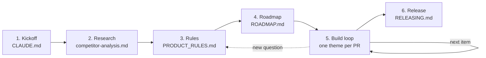

# Playbook

How an app goes from an idea to the stores. Every stage leaves a file behind, so a fresh Claude session, or you months later, can pick up from the files alone. The chat is disposable; the repo is the memory.

## 1. Kickoff: `CLAUDE.md`

- Name, one-line pitch, platforms, stack.
- **Product principles:** three to five promises every feature must keep, such as "no ads, no tracking, no account". They live in `CLAUDE.md`, so every session sees them, and every rule cites them.
- **Store IDs now:** they're permanent after the first upload. Derive them from the product (`com.<product>.app`), never from your personal name.
- **Tooling on day one (Phase 0):** CI, the format hook, `/verify`, `/release`, the version check, and branch protection. It's cheap on an empty repo and painful to retrofit.

`new-app.ps1` + `/kickoff` do all of this.

## 2. Research: `docs/research/competitor-analysis.md`

- Use the leading app hands-on with made-up data (install it on an emulator), and read its store listing and data-safety page. Describe it in your own words; copy nothing from it.
- Record what you didn't explore, so the gaps are explicit.
- Output: an at-a-glance table (them / us today / our plan), what they do well, their weak spots (your opening), a one-line positioning, and the roadmap impact.
- **Learn, don't copy.** The competitor shows what users expect. Our rule has to be better, not the same.
- If an agent drives the emulator, give it a hard cap (about 45 tool calls), a checklist of at most eight questions, and UI text dumps instead of screenshots. An uncapped run took 143 calls; the capped one took 33.

## 3. Rules: `docs/PRODUCT_RULES.md`

- One section per area: **They do** → **Learn** → **our rules**. `/spec <area>` writes one.
- A rule is testable: a number, a default, an order, an edge case. Rule IDs (`BUD-3`) are stable. Code comments, tests, PRs, roadmap items, and changelog entries cite them.
- "Not verified" marks competitor behavior you only partly saw.
- Open questions go to the user; the answers become a numbered, dated **Decisions** list.
- Rules that shape stored data (integer money, stable UUIDs, soft delete, timestamps) land in Phase 1, **before any user data exists**. Later they mean migrating real data.
- New questions come up during the build. Answer them in the rules file first, then in code.

## 4. Roadmap: `docs/ROADMAP.md`

| Phase | What | Why it's in this order |
|---|---|---|
| 0 Tooling | CI, hooks, skills, release pipeline, branch protection | Every later PR runs through it |
| 1 Foundations | Data model rules, migrations, dependency injection for tests, reliable writes, localization scaffolding | Features build on it, and it can't change cheaply once users have data |
| 2 Features | In dependency order; backup/export after the last schema step | Each item's data exists before anything reads it |
| 3 Store readiness | Names, icons, IDs, privacy policy, permission checks, packaging | Store accounts and reviews take weeks |
| 4 Before release | Late scope, dated. Languages first, first-run walkthrough last | Later PRs translate as they go; the walkthrough shows finished features |
| 5 Release | Signing, closed testing, listings, production | |

- Items cite rule IDs and get ticked in the PR that completes them.
- Every decision that adds, moves, or drops an item gets its date inline.
- Known bugs that aren't fixed yet are listed at the end of the file.

## 5. Build loop

One theme per PR. Bundle related items: one-checkbox PRs cost more review time than they save.

1. `git switch main`, `git pull --ff-only`, then branch `feat/<theme>`. Never stack on an unmerged branch.
2. `/spec <area>` if the rules aren't written yet.
3. Front-load what only a device or CI can prove, such as native glue, permissions, and platform builds (`gh workflow run ci.yml --ref <branch>`), before writing the feature on top of it.
4. Model → migration → state → screen → test → analyze. Translations go in the same change.
5. `/verify`.
6. `/ship`: coverage of the changed files, missing tests, docs, `/release`, driving the built app by hand, then the PR (`--body-file`).
7. **Stop.** You test and merge. The merge tags the version and drafts the GitHub Release.
8. `/handoff` before clearing the chat. On "resume", Claude reads it, checks `gh pr list`, and takes the next item.

## 6. Release: `docs/RELEASING.md`, `CHANGELOG.md`

- SemVer `x.y.z+N`. CI refuses a PR whose version isn't above the last tag or has no changelog entry. Merging tags `vX.Y.Z` and drafts a GitHub Release with the artifact. Drafts keep artifacts private on a public repo.
- Changelog entries are written for users: what they can now do, not class names.
- One-time store setup takes weeks. New personal Google Play accounts need a closed test (12 testers for 14 days) before production; confirm the current rule. Start it before the features are done.
- The privacy policy lives in `docs/` on GitHub Pages. Update it in every PR that touches user data.

## Lessons that earned a rule

Each of these cost real time once. The fix is already in the template.

| What happened | Rule now |
|---|---|
| Four one-item PRs in a row cost more review time than the work | Bundle by theme (`CLAUDE.md` Workflow) |
| A branch built on an unmerged branch drifted | Always branch from a freshly pulled `main` |
| PowerShell 5.1 split double quotes in a here-string: `gh pr create` failed after the push, and a failed commit left an empty branch pushed | Bodies and messages go through files: `--body-file`, `git commit -F` |
| `gh workflow run --ref` straight after a push built the previous commit | Check `git ls-remote` matches `HEAD` first, then the run's `headSha` |
| An Arabic PDF shipped with every Latin word reversed; its test only checked for `%PDF-` and a byte count | Tests assert what the user sees, e.g. read the text back out (`/ship`) |
| Hand-driving found a plural message repeated on every row and minus signs trailing in right-to-left layouts; unit tests passed | Drive every screen feature in one RTL language and one theme before the PR |
| A real device service as a constructor default hung the test suite for 10 minutes | Default to no-op fakes; build real services only in the entry point |
| A plugin would have added boot, wake-lock, and foreground-service permissions to a "collects nothing" app | CI checks the release manifest's permissions; prefer ~100 lines of glue to a heavy package |
| `dist/` still held 1.0.0 after the branch moved to 1.0.1 | `/release` rebuilds the local artifact after every app change on the branch |
| Store IDs almost carried a personal name | IDs and publisher metadata use the product name only |
| Test data on the emulator belonged to the user | Put back anything changed while testing |
| The chat gets cleared to save tokens, and context went with it | `/handoff` writes the state to memory; "resume" reads it |
